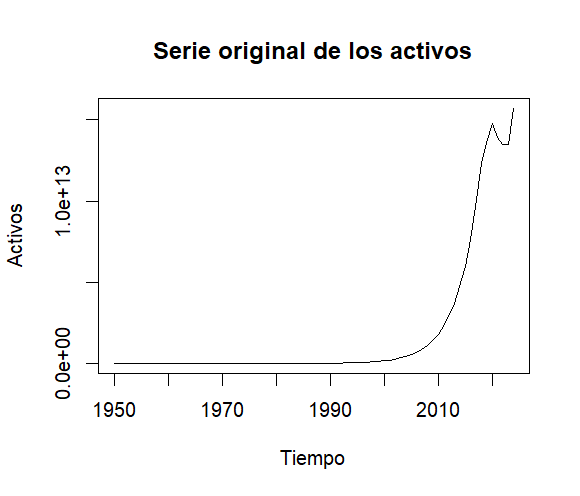
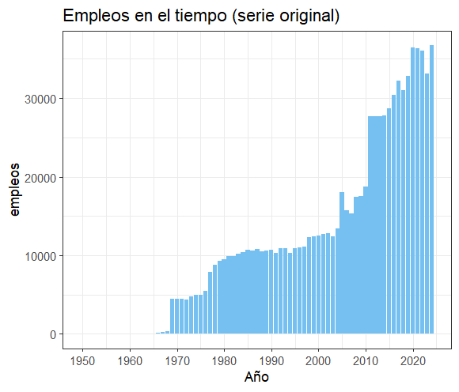
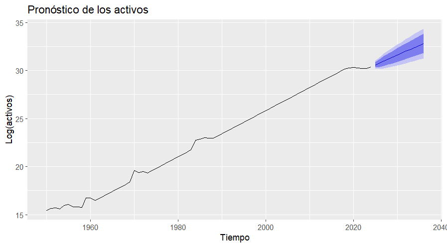

# Proyección de Activos: Análisis de Series de Tiempo (ARIMA) - Aburrá Sur

## Descripción
Este proyecto presenta un análisis econométrico y estadístico sobre la evolución histórica de los activos de una empresa líder en el sector comercio en Envigado, Antioquia. Utilizando datos que abarcan desde 1950 hasta 2024, se implementó un modelo de pronóstico para proyectar el comportamiento financiero de la organización.

El análisis incluye:
* **Caracterización empresarial** según clasificación CIIU G4711.
* **Transformaciones matemáticas** para estabilización de varianza.
* **Pruebas de hipótesis** para estacionariedad (Dickey-Fuller y KPSS).
* **Modelado predictivo** mediante la metodología Box-Jenkins (ARIMA).

## Herramientas Utilizadas
- **R / RStudio**
- **Librerías:** `forecast`, `tseries`, `tidyverse`
- **Gestión de Entorno:** `renv`

## 📊 Resultados y Visualizaciones

### 1. Evolución Histórica (1950 - 2024)
La empresa ha mostrado un crecimiento exponencial marcado, especialmente a partir de la década del 2000.

| Evolución de Activos | Generación de Empleo |
| :---: | :---: |
|  |  |

> **Nota:** Se observa una aceleración significativa en la acumulación de capital y puestos de trabajo en los últimos 20 años de trayectoria.

---

### 2. Análisis Estadístico y Modelado
Para el pronóstico, se realizaron los siguientes ajustes técnicos:

* **Transformación Logarítmica:** Aplicada para estabilizar la varianza ante el crecimiento exponencial.
* **Diferenciación:** Serie identificada como integrada de orden uno $I(1)$.
* **Selección del Modelo:** Se validó un modelo **ARIMA(0,1,0) con drift** bajo el principio de parsimonia.

### 3. Diagnóstico y Pronóstico
El modelo demuestra una alta precisión con un error porcentual reducido (**MAPE ≈ 0.6%**).

* **Diagnóstico:** El test de Ljung-Box ($p$-value = 0.5552) confirma que los residuos son ruido blanco.
* **Evolución Futura:** Se proyecta una tendencia alcista sostenida para los próximos 12 periodos.

## 📌 Conclusiones del Análisis

Tras la ejecución del modelo predictivo, se derivan las siguientes conclusiones técnicas sobre la salud financiera y el futuro de la organización:

> **Precisión del Modelo:** El modelo **ARIMA(0,1,0) con drift** alcanzó un **MAPE (Mean Absolute Percentage Error) de 0.6%**, lo que representa una precisión superior al 99% en el ajuste de los datos históricos.

### Hallazgos Principales:
* **Consolidación Histórica:** La trayectoria de 75 años muestra que la empresa no solo es resiliente, sino que mantiene un crecimiento exponencial en sus activos, especialmente acelerado en las últimas dos décadas.
* **Validación Estadística:** El test de **Ljung-Box ($p=0.5552$)** confirma que el modelo es estadísticamente robusto; los residuos son ruido blanco, lo que significa que el modelo ha capturado todas las señales y tendencias relevantes de la serie.
* **Proyección Estratégica:** El pronóstico a 12 meses indica una **tendencia alcista continua**. Al modelar con *drift* en escala logarítmica, se concluye que la empresa mantiene una tasa de crecimiento porcentual constante hacia el futuro.
* **Gestión de la Incertidumbre:** Aunque la tendencia es positiva, el ensanchamiento de los intervalos de confianza en el pronóstico sugiere que la planeación financiera debe ser cautelosa ante la volatilidad histórica inherente al sector comercio.

Este análisis transforma datos históricos en una herramienta de visión estratégica, permitiendo una toma de decisiones basada en evidencia estadística para los próximos periodos operativos.

## Autor
Marco Antonio Rolón Oliveros